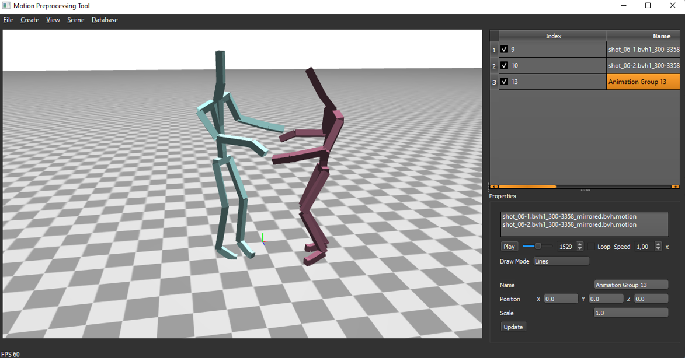

# Motion Preprocessing Tool


Visualization and editing tool for skeleton animations and statistical models It uses the OpenGL renderer of the [vis_utils](https://github.com/eherr/vis_utils) and provides functionality to retarget and edit animations based on the [anim_utils](https://github.com/eherr/anim_utils).  
Using an integrated database browser, motions can be downloaded from [https://motion.dfki.de](https://motion.dfki.de/index.php/motion-capture-data/). The code for the database is available in a separate [repository](https://github.com/eherr/motion_database_server), so a custom database can also be set up.


## Setup Instructions

1. Create a virtual environment for Python 3.6.

2. Clone the repository. 
```bat
git clone git@github.com:eherr/motion_preprocessing_tool.git
```

3. Install the base packages for [animation data editing](https://github.com/eherr/anim_utils), [visualization](https://github.com/eherr/vis_utils) and the [db interface](https://github.com/eherr/motion_db_interface).
```bat

pip install git+https://github.com/eherr/anim_utils

pip install git+https://github.com/eherr/vis_utils

pip install git+https://github.com/eherr/motion_db_interface

```


4. Optionally install the [morphablegraphs](https://github.com/eherr/morphablegraphs.git) package to create and load statistical motion models. 

```bat
pip install git+https://github.com/dfki-asr/morphablegraphs
```

5. Install other requirements. To run the tool on Windows, please download PyOpenGL from here: https://www.lfd.uci.edu/~gohlke/pythonlibs/.

```bat

pip install -r requirements.txt

```
5. Start the tool.
```bat
python main.py
```
## Functionality
BVH/ASF files can be loaded via drag and drop on the 3D visualization window. When a file is loaded a scene object is automatically created and an entry inserted into the scene object list.  
To show the animation controls select the corresponding object in the scene object list by pressing on the left most bar in the table. If the scene object was created from an ASF file, additional motions can be loaded from AMC files via the animation controls. 

Character meshes with skeletons can also be imported from the [GLTF](https://github.com/KhronosGroup/glTF) format.  

The integrated database browser gives the option to download animations from a [motion database](https://github.com/eherr/motion_database_server) as hosted on motion.dfki.de. New motions can be uploaded by selecting scene objects and opening the Upload Dialog "Database>Upload Selected Motions". 

<p align="center">
<em>Screenshot of the main window and the database browser.</em>
</p>
Skeleton animations can be edited by opening an editor window via the animation controls. The editor offers functions to change joint parameters directly or applying inverse kinematics. Furthermore, it is possible to create semantic annotations in a separate editor. The annotation can be used to cut the motions which results in new copies in the scene.

The tool also offers the retargeting of motions to different skeletons. For this purpose a skeleton model has to be defined first locally or in the database. The skeleton model contains the definition of a mapping of the skeleton joints to a standard joint list and local coordinate systems for each joint. It can be defined via a skeleton editor which can be opened in the animation player widget or directly in the database browser. Locally and remotely defined skeletons can be synchronized by clicking on "Database>Synchronize Skeleton Definitions" and selecting which skeletons to upload or download. The skeletons will be stored locally in json files in the data directory specified in the config file.

Note, all database interactions which add, edit or delete data, require the user to login first using "Database>Login". This will store a session file for later interactions. To create a new user in the database, you need to have shell access to the server and use a script provided in the [database repository](https://github.com/eherr/motion_database_server).


## Controls

Camera control:  
Rotation: Middle Mouse Button  
Translation: Shift + Middle Mouse Button  
Zoom: Mouse Wheel  

Keyboard Shortcuts:  
CTRL+T: follow selected animation/stop following selected animation  
DEL: delete selected scene object  
CTRL+H: hide/unhide selected scene object  

## Publication
Herrmann, E., Du, H., Antalki, A., Rubinstein, D., Schubotz, R., Sprenger, J., Hosseini, S., Cheema, N., Zinnikus, I., Manns, M., Fischer, K. Slusallek, P., "Motion Data and Model Management for Applied Statistical Motion Synthesis" In: Proceedings of the Conference on Smart Tools and Applications in Computer Graphics. Eurographics Association, 2019.


## License
Copyright (c) 2019 DFKI GmbH.  
MIT License, see the LICENSE file.  
The submodules [anim_utils](https://github.com/eherr/anim_utils.git) and [morphablegraphs](https://github.com/eherr/morphablegraphs.git) were developed by DFKI GmbH in cooperation with the Daimler AG and are released under the MIT license.  
The submodule [vis_utils](https://github.com/eherr/vis_utils.git) was developed as a side project by developers at the DFKI GmbH and is released under the MIT license.  
The dependency [PySide2](https://wiki.qt.io/Qt_for_Python) (Qt for Python) is used under the [LGPL-3.0](https://www.gnu.org/licenses/lgpl-3.0.html) license.  
The application uses a stylesheet and icons by [Yasin Uludag](http://discourse.techart.online/t/release-qt-dark-orange-stylesheet/2287).

